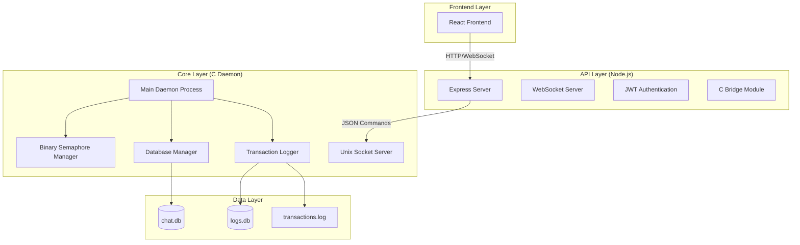

# Design Document

## Overview

The Binary-Semaphore Chat System backend implements a two-layer architecture that demonstrates Operating System synchronization techniques. The system uses a binary semaphore (mutex) to control concurrent write access to a shared chat database, with comprehensive transaction logging for audit purposes.

The design separates concerns between a low-level C daemon handling critical operations and a high-level Node.js API layer managing web communication. This architecture ensures thread safety, data integrity, and scalable concurrent access while maintaining clear separation of responsibilities.

## Architecture

### System Components



### Communication Flow

1. **Frontend → Node.js API**: HTTP requests and WebSocket connections
2. **Node.js API → C Daemon**: JSON messages over Unix domain socket
3. **C Daemon → Databases**: Direct SQLite C API calls
4. **C Daemon → Node.js API**: JSON responses with operation results

## Components and Interfaces

### C Core Daemon

#### Main Daemon Process (`main.c`)
- **Purpose**: Entry point and main event loop
- **Responsibilities**:
  - Initialize all subsystems (database, logging, semaphore)
  - Create and bind Unix domain socket
  - Accept client connections and spawn handler threads
  - Graceful shutdown handling

#### Binary Semaphore Manager (`semaphore.c/.h`)
- **Purpose**: Manage mutual exclusion for write operations
- **Key Functions**:
  ```c
  int init_semaphore(void);
  int try_acquire_writer(const char *username);
  int release_writer(const char *username);
  int get_semaphore_status(char *holder, int *value);
  int admin_toggle_writer(bool enabled, const char *admin_user);
  ```
- **Data Structures**:
  ```c
  typedef struct {
      pthread_mutex_t write_mutex;
      pthread_mutex_t admin_mutex;
      char current_holder[64];
      bool writer_enabled;
  } semaphore_state_t;
  ```

#### Database Manager (`db.c/.h`)
- **Purpose**: Handle all SQLite operations for both databases
- **Key Functions**:
  ```c
  int init_databases(const char *chat_db_path, const char *log_db_path);
  int create_message(const char *username, const char *message, char *out_timestamp);
  int update_message(int id, const char *username, const char *message);
  int delete_message(int id, const char *username);
  int list_messages(int page, int limit, char *out_json);
  int get_logs(int page, int limit, char *out_json);
  ```
- **Database Connections**:
  - Separate SQLite connections for chat.db and logs.db
  - WAL mode enabled for concurrent read access
  - Prepared statements for all queries

#### Transaction Logger (`logger.c/.h`)
- **Purpose**: Record all operations to database and file
- **Key Functions**:
  ```c
  int init_logger(const char *log_file_path);
  void log_transaction(const char *action, const char *user, 
                      const char *content, int semaphore_value);
  void log_semaphore_event(const char *action, const char *user, int value);
  ```
- **Log Format**:
  ```json
  {
    "ts": "2025-10-21T14:03:15",
    "action": "CREATE|UPDATE|DELETE|ACQUIRE_MUTEX|RELEASE_MUTEX|READ",
    "user": "username",
    "content": "message content or null",
    "semaphore": 0
  }
  ```

#### Command Handler (`handlers.c/.h`)
- **Purpose**: Parse JSON commands and execute operations
- **Key Functions**:
  ```c
  int handle_command(const char *json_input, char *json_output);
  int parse_json_command(const char *input, command_t *cmd);
  int execute_command(const command_t *cmd, response_t *resp);
  ```
- **Command Types**:
  ```c
  typedef enum {
      CMD_TRY_ACQUIRE,
      CMD_RELEASE,
      CMD_CREATE_MESSAGE,
      CMD_UPDATE_MESSAGE,
      CMD_DELETE_MESSAGE,
      CMD_LIST_MESSAGES,
      CMD_GET_STATUS,
      CMD_GET_LOGS,
      CMD_TOGGLE_WRITER
  } command_type_t;
  ```

### Node.js API Layer

#### Express Server (`server.js`)
- **Purpose**: Main HTTP server with middleware setup
- **Middleware Stack**:
  - CORS handling
  - JSON body parsing
  - JWT authentication
  - Rate limiting
  - Error handling

#### Authentication Module (`auth.js`)
- **Purpose**: Handle user authentication and JWT management
- **Endpoints**:
  - `POST /api/login` - User authentication
  - `POST /api/signup` - User registration
- **JWT Payload**:
  ```json
  {
    "username": "user123",
    "role": "reader|writer|admin",
    "iat": 1634567890,
    "exp": 1634654290
  }
  ```

#### Message Routes (`routes/messages.js`)
- **Purpose**: Handle chat message operations
- **Endpoints**:
  - `GET /api/messages` - List messages (reader/writer)
  - `POST /api/messages` - Create message (writer only)
  - `PUT /api/messages/:id` - Update message (writer only)
  - `DELETE /api/messages/:id` - Delete message (writer only)

#### Writer Routes (`routes/writer.js`)
- **Purpose**: Handle semaphore operations
- **Endpoints**:
  - `POST /api/writer/request` - Request semaphore
  - `POST /api/writer/release` - Release semaphore
  - `GET /api/status` - Get semaphore status

#### Admin Routes (`routes/admin.js`)
- **Purpose**: Administrative functions
- **Endpoints**:
  - `GET /api/logs` - View transaction logs
  - `POST /api/admin/toggle-writer` - Enable/disable writers

#### C Bridge Module (`cbridge.js`)
- **Purpose**: Communication interface with C daemon
- **Key Functions**:
  ```javascript
  async function sendCommand(command)
  function connect()
  function disconnect()
  function isConnected()
  ```
- **Connection Management**:
  - Unix domain socket connection
  - Automatic reconnection on failure
  - Command queuing during disconnection

#### WebSocket Server (`websocket.js`)
- **Purpose**: Real-time status updates
- **Events**:
  - `semaphore_status` - Current semaphore state
  - `message_created` - New message notification
  - `writer_changed` - Writer acquisition/release

## Data Models

### Chat Database Schema (chat.db)

```sql
CREATE TABLE messages (
    id INTEGER PRIMARY KEY AUTOINCREMENT,
    username TEXT NOT NULL,
    message TEXT NOT NULL CHECK(length(message) <= 2000),
    created_at TEXT NOT NULL -- ISO 8601 format
);

CREATE INDEX idx_messages_created_at ON messages(created_at DESC);
CREATE INDEX idx_messages_username ON messages(username);
```

### Logs Database Schema (logs.db)

```sql
CREATE TABLE transactions (
    id INTEGER PRIMARY KEY AUTOINCREMENT,
    ts TEXT NOT NULL, -- ISO 8601 timestamp
    action TEXT NOT NULL CHECK(action IN (
        'CREATE', 'UPDATE', 'DELETE', 'READ',
        'ACQUIRE_MUTEX', 'RELEASE_MUTEX', 'ADMIN_ACTION'
    )),
    user TEXT,
    content TEXT CHECK(length(content) <= 2000),
    semaphore_value INTEGER NOT NULL CHECK(semaphore_value IN (0, 1))
);

CREATE INDEX idx_transactions_ts ON transactions(ts DESC);
CREATE INDEX idx_transactions_action ON transactions(action);
CREATE INDEX idx_transactions_user ON transactions(user);
```

### JSON Message Formats

#### C Daemon Commands
```json
{
  "action": "TRY_ACQUIRE|RELEASE|CREATE|UPDATE|DELETE|LIST|STATUS|LOGS|TOGGLE",
  "user": "username",
  "message": "content",
  "id": 123,
  "page": 1,
  "limit": 50,
  "enabled": true
}
```

#### C Daemon Responses
```json
{
  "status": "OK|ERROR",
  "error": "error message",
  "data": {
    "id": 123,
    "timestamp": "2025-10-21T14:03:15",
    "semaphore": 0,
    "holder": "username",
    "messages": [...],
    "logs": [...]
  }
}
```

## Error Handling

### C Daemon Error Codes
- `0` - Success
- `-1` - General error
- `-2` - Permission denied
- `-3` - Resource unavailable (semaphore locked)
- `-4` - Invalid input
- `-5` - Database error

### Node.js HTTP Status Codes
- `200` - Success
- `400` - Bad Request (invalid input)
- `401` - Unauthorized (invalid/missing JWT)
- `403` - Forbidden (insufficient permissions)
- `409` - Conflict (semaphore unavailable)
- `500` - Internal Server Error

### Error Recovery Strategies

#### C Daemon Crashes
- Systemd automatic restart
- Semaphore state reset on startup
- Log forced release event
- Database integrity check on startup

#### Database Corruption
- SQLite integrity check on startup
- Automatic backup before critical operations
- Transaction rollback on errors
- WAL checkpoint on shutdown

#### Communication Failures
- Node.js automatic reconnection to C daemon
- Command retry with exponential backoff
- Graceful degradation (read-only mode)
- Client notification of service unavailability

## Testing Strategy

### Unit Testing

#### C Daemon Tests
- **Semaphore Operations**: Test acquire/release logic, concurrent access
- **Database Operations**: Test CRUD operations, transaction integrity
- **JSON Parsing**: Test command parsing and response generation
- **Logging**: Test log entry creation and file operations

#### Node.js Tests
- **Authentication**: Test JWT creation/validation, role checking
- **API Endpoints**: Test all HTTP endpoints with various inputs
- **C Bridge**: Test communication with mock C daemon
- **WebSocket**: Test real-time event broadcasting

### Integration Testing

#### End-to-End Flows
- **Reader Flow**: Login → View messages → Logout
- **Writer Flow**: Login → Acquire semaphore → CRUD operations → Release
- **Admin Flow**: Login → View logs → Toggle writer access
- **Concurrent Access**: Multiple writers attempting simultaneous access

#### Database Integration
- **Transaction Logging**: Verify all operations are logged correctly
- **Data Consistency**: Verify chat.db and logs.db remain consistent
- **Crash Recovery**: Test system behavior after unexpected shutdowns

### Performance Testing

#### Load Testing
- **Concurrent Readers**: 100+ simultaneous read operations
- **Writer Contention**: Multiple writers competing for semaphore
- **Database Performance**: Large message volumes and query performance
- **WebSocket Scaling**: Many connected clients receiving updates

#### Stress Testing
- **Memory Usage**: Long-running daemon memory stability
- **File Descriptor Limits**: Many simultaneous connections
- **Database Locking**: Extended write operations under load
- **Log File Growth**: Continuous operation with log rotation

### Security Testing

#### Authentication Testing
- **JWT Validation**: Invalid tokens, expired tokens, role escalation
- **Input Sanitization**: SQL injection attempts, XSS prevention
- **Rate Limiting**: Brute force protection, DoS prevention

#### Access Control Testing
- **Role Enforcement**: Verify reader/writer/admin boundaries
- **Semaphore Security**: Unauthorized release attempts
- **File Permissions**: Log file access restrictions

## Deployment Architecture

### System Services

#### C Daemon Service
```ini
[Unit]
Description=Binary Semaphore Chat Daemon
After=network.target

[Service]
Type=simple
User=chatsvc
Group=chatsvc
ExecStart=/usr/local/bin/chat_daemon
Restart=on-failure
RestartSec=5

[Install]
WantedBy=multi-user.target
```

#### Node.js API Service
```ini
[Unit]
Description=Chat API Server
After=network.target chat-daemon.service
Requires=chat-daemon.service

[Service]
Type=simple
User=chatapi
Group=chatapi
ExecStart=/usr/bin/node /opt/chat-api/server.js
Restart=on-failure
RestartSec=5

[Install]
WantedBy=multi-user.target
```

### File System Layout
```
/opt/chat-system/
├── bin/
│   └── chat_daemon
├── api/
│   ├── server.js
│   ├── routes/
│   └── modules/
└── config/
    └── config.json

/var/lib/chat-system/
├── chat.db
└── logs.db

/var/log/chat-system/
└── transactions.log

/run/chat-system/
└── daemon.sock
```

### Security Configuration

#### File Permissions
- `/var/lib/chat-system/`: 750 chatsvc:chatsvc
- `/var/log/chat-system/transactions.log`: 600 chatsvc:chatsvc
- `/run/chat-system/daemon.sock`: 660 chatsvc:chatapi

#### Network Security
- HTTPS only in production
- Rate limiting on all endpoints
- CORS properly configured
- JWT secret rotation capability