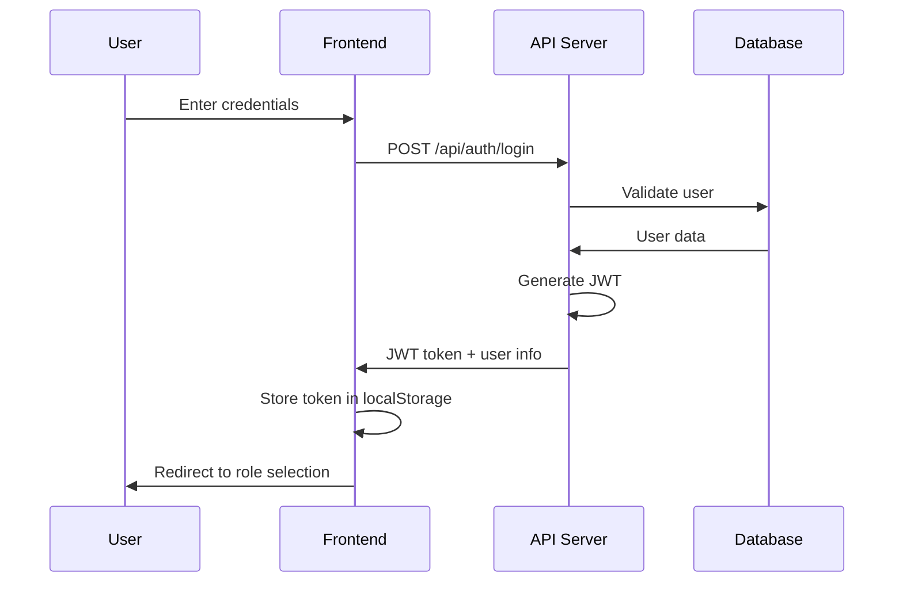
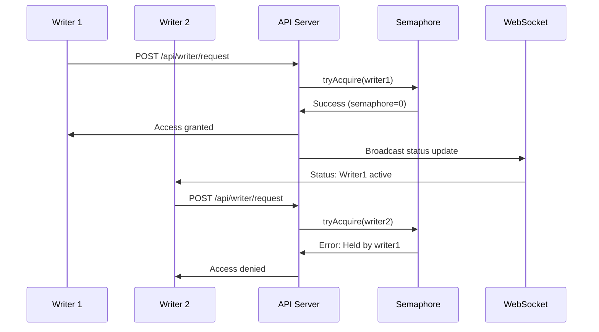
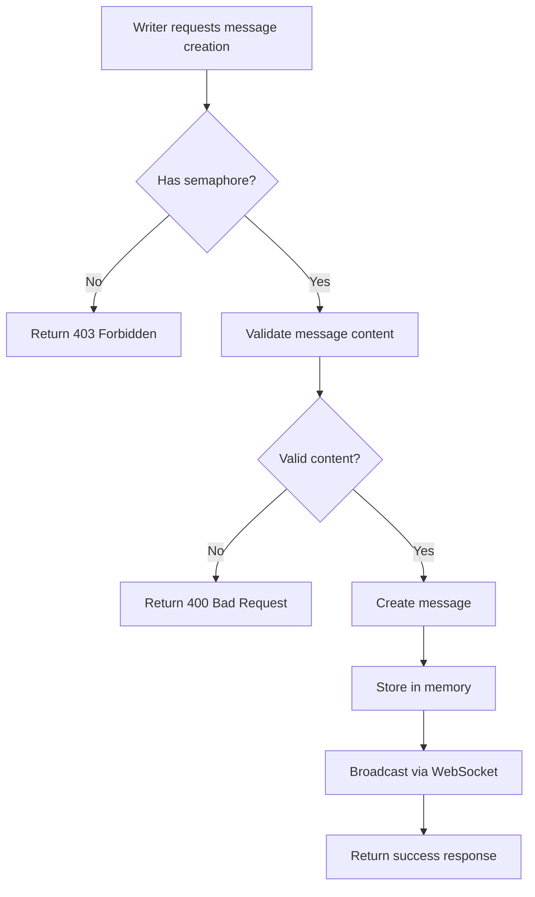

# 🔒 MutexTalk

_A full-stack real-time chat application demonstrating binary semaphore concurrency control_


## 📚 Table of Contents

- [🎯 Project Overview](#-project-overview)
- [🎯 Problem Statement](#-problem-statement)
- [🎯 Scope and Objectives](#-scope-and-objectives)
- [📋 Functional and Non-functional Requirements](#-functional-and-non-functional-requirements)
- [✨ Features](#-features)
- [🏗️ System Architecture](#️-system-architecture)
- [📊 Data Flow Diagrams](#-data-flow-diagrams)
- [👥 Use Case Diagrams](#-use-case-diagrams)
- [🗄️ Database Design](#️-database-design)
- [🔌 API/Module Descriptions](#-apimodule-descriptions)
- [🚀 Quick Start](#-quick-start)
- [🔬 Concurrency Control Deep Dive](#-concurrency-control-deep-dive)
- [📁 Project Structure](#-project-structure)
- [🔧 Configuration](#-configuration)
- [🧪 Testing Plan](#-testing-plan)
- [🚀 Deployment](#-deployment)
- [🔧 Maintenance](#-maintenance)
- [🧪 Testing the Semaphore](#-testing-the-semaphore)
- [�️ Monitoring & Debugging](#-monitoring--debugging)
- [� ️ Security Features](#️-security-features)
- [🚧 Known Limitations](#-known-limitations)
- [🔮 Future Enhancements](#-future-enhancements)
- [🤝 Contributing](#-contributing)
- [📄 License](#-license)
- [🙏 Acknowledgments](#-acknowledgments)
- [👨‍💻 Author](#-author)

---

## 🎯 Project Overview

MutexTalk is a sophisticated chat application that demonstrates **binary semaphore synchronization** in a real-world scenario. Only one writer can post messages at a time, showcasing mutual exclusion principles while maintaining a smooth user experience through real-time WebSocket updates.

### 🔑 Key Concept

The application enforces **mutual exclusion** - when one writer acquires the "write lock," all other writers must wait until it's released. This demonstrates classic concurrency control patterns used in operating systems and distributed systems.

## 🎯 Problem Statement

In concurrent systems, multiple processes or threads often need to access shared resources simultaneously. Without proper synchronization mechanisms, this leads to:

- **Race Conditions** - Unpredictable outcomes when multiple writers modify data simultaneously
- **Data Inconsistency** - Corrupted or incomplete data due to interleaved operations
- **Resource Conflicts** - Multiple processes competing for the same resource without coordination

### Real-world Scenario

Consider a collaborative document editing system where multiple users can edit simultaneously. Without proper locking mechanisms, users might overwrite each other's changes, leading to data loss and inconsistent document states.

## 🎯 Scope and Objectives

### Project Scope

- **Primary Focus**: Demonstrate binary semaphore implementation in a web application
- **Target Audience**: Computer science students, developers learning concurrency
- **Platform**: Cross-platform web application (Windows, Linux, macOS)
- **Scale**: Small to medium-scale concurrent users (10-100 simultaneous connections)

### Objectives

1. **Educational**: Provide hands-on experience with concurrency control mechanisms
2. **Practical**: Implement a working chat system with real-world constraints
3. **Technical**: Demonstrate full-stack development with modern technologies
4. **Performance**: Maintain responsive UI while enforcing strict synchronization
5. **Security**: Implement production-ready authentication and authorization

## 📋 Functional and Non-functional Requirements

### Functional Requirements

#### User Management

- **FR-1**: Users can register with unique usernames and secure passwords
- **FR-2**: Users can login with JWT-based authentication
- **FR-3**: System supports three user roles: Admin, Writer, Reader
- **FR-4**: Users can logout and invalidate their session

#### Semaphore Operations

- **FR-5**: Only one writer can acquire the semaphore at any given time
- **FR-6**: Writers must explicitly request semaphore before posting messages
- **FR-7**: Writers must release semaphore after completing operations
- **FR-8**: System prevents unauthorized semaphore operations

#### Message Operations

- **FR-9**: Writers can create, update, and delete messages while holding semaphore
- **FR-10**: Readers can view all messages without semaphore restrictions
- **FR-11**: All users receive real-time updates via WebSocket

#### Administrative Functions

- **FR-12**: Admins can view system logs and user activities
- **FR-13**: Admins can enable/disable writer access globally
- **FR-14**: Admins can monitor semaphore status and current holder

### Non-functional Requirements

#### Performance

- **NFR-1**: System response time < 200ms for API calls
- **NFR-2**: WebSocket updates delivered within 100ms
- **NFR-3**: Support minimum 50 concurrent users
- **NFR-4**: 99.9% uptime during normal operations

#### Security

- **NFR-5**: All passwords encrypted using bcrypt (min 10 rounds)
- **NFR-6**: JWT tokens expire within 1 hour
- **NFR-7**: Rate limiting: 50 requests/minute per user
- **NFR-8**: Input validation and sanitization on all endpoints

#### Usability

- **NFR-9**: Responsive design supporting mobile and desktop
- **NFR-10**: Intuitive UI with clear semaphore status indicators
- **NFR-11**: Real-time feedback for all user actions

#### Reliability

- **NFR-12**: Graceful handling of network disconnections
- **NFR-13**: Automatic semaphore cleanup on user disconnect
- **NFR-14**: System recovery after server restart

## ✨ Features

- 🔐 **Binary Semaphore Control** - Only one writer can post at a time
- ⚡ **Real-time Updates** - WebSocket-powered live status updates
- 👥 **Role-based Access** - Admin, Writer, and Reader roles
- 🔒 **JWT Authentication** - Secure user sessions
- 📱 **Responsive UI** - Modern React interface with Tailwind CSS
- 🛡️ **Production Security** - Rate limiting, CORS, security headers
- 🚀 **Easy Deployment** - Docker, systemd, and manual deployment options

## 🏗️ System Architecture

### High-Level Architecture

```
┌─────────────────┐    ┌─────────────────┐    ┌─────────────────┐
│   React Frontend│    │   Node.js API   │    │   C Daemon      │
│                 │    │                 │    │                 │
│ • Auth Pages    │◄──►│ • JWT Auth      │◄──►│ • Semaphore     │
│ • Writer/Reader │    │ • WebSocket     │    │ • HTTP Server   │
│ • Real-time UI  │    │ • Rate Limiting │    │ • Cross-platform│
└─────────────────┘    └─────────────────┘    └─────────────────┘
```

### Detailed Component Architecture

```
┌─────────────────────────────────────────────────────────────────┐
│                        PRESENTATION LAYER                       │
├─────────────────────────────────────────────────────────────────┤
│  React Frontend (Port 5173)                                    │
│  ├── Authentication Pages (Login/Signup)                       │
│  ├── Role Selection Interface                                  │
│  ├── Writer Interface (Message CRUD)                           │
│  ├── Reader Interface (Message View)                           │
│  ├── Admin Dashboard (Logs, Controls)                          │
│  └── WebSocket Client (Real-time Updates)                      │
└─────────────────────────────────────────────────────────────────┘
                                │
                                ▼
┌─────────────────────────────────────────────────────────────────┐
│                        APPLICATION LAYER                        │
├─────────────────────────────────────────────────────────────────┤
│  Node.js API Server (Port 3000)                                │
│  ├── Authentication Module (JWT, bcrypt)                       │
│  ├── Authorization Middleware (Role-based)                     │
│  ├── Rate Limiting & Security Headers                          │
│  ├── WebSocket Manager (Real-time broadcasts)                  │
│  ├── API Routes (Auth, Messages, Writer, Admin)                │
│  └── C-Daemon Bridge (HTTP communication)                      │
└─────────────────────────────────────────────────────────────────┘
                                │
                                ▼
┌─────────────────────────────────────────────────────────────────┐
│                         BUSINESS LAYER                          │
├─────────────────────────────────────────────────────────────────┤
│  Semaphore Management                                           │
│  ├── In-Memory Semaphore State                                 │
│  ├── Mutex Lock/Unlock Operations                              │
│  ├── Ownership Validation                                      │
│  └── Concurrent Access Control                                 │
└─────────────────────────────────────────────────────────────────┘
                                │
                                ▼
┌─────────────────────────────────────────────────────────────────┐
│                          DATA LAYER                             │
├─────────────────────────────────────────────────────────────────┤
│  C Daemon (Port 8081) - Optional                               │
│  ├── HTTP Server (Cross-platform)                              │
│  ├── Binary Semaphore Implementation                           │
│  ├── Message Storage (In-memory)                               │
│  └── Logging System                                            │
└─────────────────────────────────────────────────────────────────┘
```

## 📊 Data Flow Diagrams

### User Authentication Flow



### Semaphore Acquisition Flow



### Message Creation Flow



## 👥 Use Case Diagrams

### Primary Actors and Use Cases

```
                    ┌─────────────────┐
                    │     Reader      │
                    └─────────────────┘
                            │
                            │ views
                            ▼
    ┌─────────────────┐ ◄─────────────────► ┌─────────────────┐
    │     Writer      │                     │    Messages     │
    └─────────────────┘                     └─────────────────┘
            │                                       ▲
            │ manages                               │
            ▼                                       │ monitors
    ┌─────────────────┐                             │
    │   Semaphore     │                             │
    └─────────────────┘                             │
            ▲                                       │
            │ controls                              │
            │                                       │
    ┌─────────────────┐ ◄─────────────────────────────┘
    │     Admin       │
    └─────────────────┘
```

### Detailed Use Cases

#### Writer Use Cases

- **UC-1**: Request semaphore access
- **UC-2**: Release semaphore access
- **UC-3**: Create new message
- **UC-4**: Update existing message
- **UC-5**: Delete message
- **UC-6**: View all messages

#### Reader Use Cases

- **UC-7**: View all messages
- **UC-8**: Receive real-time updates

#### Admin Use Cases

- **UC-9**: View system logs
- **UC-10**: Monitor semaphore status
- **UC-11**: Enable/disable writer access
- **UC-12**: View user activities

### Tech Stack

| Component       | Technology                               |
| --------------- | ---------------------------------------- |
| **Frontend**    | React 18, TypeScript, Tailwind CSS, Vite |
| **Backend**     | Node.js, Express, WebSocket, JWT         |
| **Concurrency** | Binary Semaphore (in-memory + C daemon)  |
| **Database**    | In-memory (with SQLite option)           |
| **Deployment**  | Docker, systemd, PM2                     |

## 🗄️ Database Design

### In-Memory Data Structures

#### User Store

```javascript
Map<username, {
  username: string,
  password: string (hashed),
  role: 'admin' | 'writer' | 'reader',
  createdAt: ISO8601,
  lastLogin: ISO8601,
  loginAttempts: number,
  lockedUntil: ISO8601
}>
```

#### Message Store

```javascript
Array<{
  id: number,
  username: string,
  message: string,
  created_at: ISO8601,
  updated_at?: ISO8601
}>
```

#### Semaphore State

```javascript
{
  isLocked: boolean,
  currentHolder: string | null,
  writerEnabled: boolean
}
```

### Optional SQLite Schema (C Daemon)

```sql
-- Users table
CREATE TABLE users (
    id INTEGER PRIMARY KEY AUTOINCREMENT,
    username VARCHAR(50) UNIQUE NOT NULL,
    password_hash VARCHAR(255) NOT NULL,
    role VARCHAR(20) NOT NULL,
    created_at TIMESTAMP DEFAULT CURRENT_TIMESTAMP
);

-- Messages table
CREATE TABLE messages (
    id INTEGER PRIMARY KEY AUTOINCREMENT,
    username VARCHAR(50) NOT NULL,
    message TEXT NOT NULL,
    created_at TIMESTAMP DEFAULT CURRENT_TIMESTAMP,
    updated_at TIMESTAMP,
    FOREIGN KEY (username) REFERENCES users(username)
);

-- Logs table
CREATE TABLE logs (
    id INTEGER PRIMARY KEY AUTOINCREMENT,
    timestamp TIMESTAMP DEFAULT CURRENT_TIMESTAMP,
    action VARCHAR(50) NOT NULL,
    username VARCHAR(50),
    content TEXT,
    semaphore_value INTEGER
);
```

## 🔌 API/Module Descriptions

### Authentication Module (`node-api/modules/auth.js`)

#### Functions

- `registerUser(username, password, role)` - Create new user account
- `authenticateUser(username, password)` - Validate login credentials
- `generateToken(user)` - Create JWT token
- `verifyToken(token)` - Validate JWT token

#### Security Features

- bcrypt password hashing (10+ rounds)
- Brute force protection (5 attempts → 15min lockout)
- JWT with 1-hour expiration
- Role-based access control

### Semaphore Module (`node-api/modules/cbridge.js`)

#### Core Methods

```javascript
class CDaemonBridge {
  // Semaphore operations
  async tryAcquireWriter(username)
  async releaseWriter(username)
  async getStatus()

  // Message operations
  async createMessage(username, message)
  async updateMessage(username, messageId, message)
  async deleteMessage(username, messageId)
  async listMessages(page, limit)
}
```

### WebSocket Module (`node-api/modules/websocket.js`)

#### Event Types

- `semaphore_status` - Semaphore state changes
- `message_created` - New message notifications
- `writer_changed` - Writer acquisition/release events

### API Endpoints

#### Authentication Routes (`/api/auth`)

```
POST /login     - User authentication
POST /signup    - User registration
POST /logout    - Session termination
GET  /me        - Current user info
```

#### Writer Routes (`/api/writer`)

```
POST /request   - Request semaphore
POST /release   - Release semaphore
```

#### Message Routes (`/api/messages`)

```
GET    /        - List messages
POST   /        - Create message
PUT    /:id     - Update message
DELETE /:id     - Delete message
```

#### Admin Routes (`/api/admin`)

```
GET  /logs           - View system logs
POST /toggle-writer  - Enable/disable writers
```

## 🧪 Testing Plan

### Unit Testing

- **Authentication Module**: Password hashing, JWT generation/validation
- **Semaphore Logic**: Acquire/release operations, ownership validation
- **Message Operations**: CRUD operations, permission checks
- **WebSocket Events**: Event broadcasting, client management

### Integration Testing

- **API Endpoints**: Request/response validation, error handling
- **Database Operations**: Data persistence, transaction integrity
- **Authentication Flow**: Login/logout, token validation
- **Real-time Updates**: WebSocket message delivery

### Concurrency Testing

- **Race Conditions**: Multiple simultaneous semaphore requests
- **Stress Testing**: High-frequency acquire/release operations
- **Load Testing**: Multiple concurrent users (50+ connections)
- **Deadlock Prevention**: Timeout mechanisms, cleanup procedures

### User Acceptance Testing

- **Functional Scenarios**: Complete user workflows
- **Cross-browser Testing**: Chrome, Firefox, Safari, Edge
- **Mobile Responsiveness**: iOS Safari, Android Chrome
- **Network Conditions**: Slow connections, intermittent connectivity

### Test Scenarios

#### Scenario 1: Basic Semaphore Operation

```
1. Writer1 logs in and requests semaphore → Success
2. Writer2 logs in and requests semaphore → Denied
3. Writer1 releases semaphore → Success
4. Writer2 requests semaphore → Success
```

#### Scenario 2: Concurrent Access Prevention

```
1. Multiple writers simultaneously request semaphore
2. Only one should succeed
3. Others should receive appropriate error messages
4. Real-time updates should reflect current state
```

#### Scenario 3: Network Disconnection Recovery

```
1. Writer acquires semaphore
2. Network disconnection occurs
3. System should auto-release semaphore after timeout
4. Other writers should be able to acquire access
```

## 🚀 Quick Start

### Prerequisites

- Node.js 18+
- npm or yarn
- Git

### Installation

```bash
# Clone the repository
git clone https://github.com/AkZcH/MutexTalk.git
cd MutexTalk

# Start the full application
chmod +x start-fullstack.sh
./start-fullstack.sh
```

**Or manually:**

```bash
# Terminal 1 - Backend
cd node-api
npm install
npm start

# Terminal 2 - Frontend
cd frontend
npm install
npm run dev
```

### 🎮 Usage

1. **Open your browser** to `http://localhost:5173`
2. **Login with demo accounts:**

   - Admin: `admin` / `admin123`
   - Writer: `writer1` / `writer123`
   - Writer: `writer2` / `writer456`
   - Reader: `reader1` / `reader123`

3. **Test the semaphore:**
   - Open **two browsers** (Chrome + Firefox)
   - Login as different writers
   - Try to acquire write access - only one succeeds!
   - Watch real-time status updates

## 🔬 Concurrency Control Deep Dive

### Binary Semaphore Implementation

```javascript
// Simplified semaphore logic
class SemaphoreState {
  constructor() {
    this.isLocked = false;
    this.currentHolder = null;
  }

  tryAcquire(username) {
    if (this.isLocked) {
      return { error: `Held by ${this.currentHolder}` };
    }

    this.isLocked = true;
    this.currentHolder = username;
    return { success: true };
  }

  release(username) {
    if (this.currentHolder !== username) {
      return { error: "Permission denied" };
    }

    this.isLocked = false;
    this.currentHolder = null;
    return { success: true };
  }
}
```

### Real-time Synchronization Flow

1. **Writer 1** requests access → ✅ Granted (semaphore = 0)
2. **Writer 2** requests access → ❌ Denied ("Held by Writer 1")
3. **All users** receive WebSocket update: "Writer 1 active"
4. **Writer 1** releases → Semaphore available (semaphore = 1)
5. **All users** receive update: "Available"
6. **Writer 2** can now acquire access

## 📁 Project Structure

```
MutexTalk/
├── 📱 frontend/                 # React TypeScript app
│   ├── src/
│   │   ├── pages/              # Auth, Writer, Reader, Admin
│   │   ├── lib/api.ts          # API client with WebSocket
│   │   └── components/         # UI components
│   └── package.json
├── 🔧 node-api/                # Node.js backend
│   ├── routes/                 # API endpoints
│   ├── modules/                # Core logic (auth, semaphore, WebSocket)
│   ├── middleware/             # JWT, rate limiting
│   └── server.js
├── ⚙️ c-daemon/                # C semaphore daemon (optional)
│   ├── src/                    # C source files
│   ├── include/                # Headers
│   └── Makefile
├── 🚀 scripts/                 # Deployment scripts
├── 📋 systemd/                 # Linux service files
└── 📖 docs/                    # Documentation
```

## 🔧 Configuration

### Environment Variables

```bash
# node-api/.env
JWT_SECRET=your-super-secret-key-here
PORT=3000
NODE_ENV=development
DAEMON_URL=http://localhost:8081
```

### Demo Accounts

| Username  | Password    | Role   | Description            |
| --------- | ----------- | ------ | ---------------------- |
| `admin`   | `admin123`  | Admin  | Full system control    |
| `writer1` | `writer123` | Writer | Can acquire write lock |
| `writer2` | `writer456` | Writer | Can acquire write lock |
| `reader1` | `reader123` | Reader | Read-only access       |

## 🚀 Deployment

### Development Environment

```bash
# Quick start for development
./start-fullstack.sh

# Or manually
cd node-api && npm start &
cd frontend && npm run dev &
```

### Production Deployment Options

#### Option 1: Docker (Recommended)

```bash
# Using Docker Compose
docker-compose up -d

# Or build custom images
docker build -t mutextalk-api ./node-api
docker build -t mutextalk-frontend ./frontend
```

#### Option 2: Linux with systemd

```bash
# Automated installation
sudo ./scripts/install.sh

# Manual service management
sudo systemctl enable chat-system.target
sudo systemctl start chat-system.target
sudo systemctl status chat-system.target
```

#### Option 3: Manual Production Setup

```bash
# Build frontend for production
cd frontend
npm run build
cp -r dist/* /var/www/mutextalk/

# Configure Nginx
sudo cp nginx.conf /etc/nginx/sites-available/mutextalk
sudo ln -s /etc/nginx/sites-available/mutextalk /etc/nginx/sites-enabled/
sudo systemctl reload nginx

# Start backend with PM2
cd node-api
npm install --production
pm2 start ecosystem.config.js
pm2 save
pm2 startup
```

#### Option 4: Cloud Deployment (AWS/Azure/GCP)

```bash
# Using PM2 with cloud instances
pm2 deploy production setup
pm2 deploy production
```

### Environment Configuration

#### Production Environment Variables

```bash
# node-api/.env.production
NODE_ENV=production
PORT=3000
JWT_SECRET=your-super-secure-secret-key-here
DAEMON_URL=http://localhost:8081
ALLOWED_ORIGINS=https://yourdomain.com,https://www.yourdomain.com
SSL_CERT_PATH=/etc/ssl/certs/mutextalk.crt
SSL_KEY_PATH=/etc/ssl/private/mutextalk.key
```

#### Nginx Configuration

```nginx
server {
    listen 80;
    server_name yourdomain.com;

    # Frontend static files
    location / {
        root /var/www/mutextalk;
        try_files $uri $uri/ /index.html;
    }

    # API proxy
    location /api {
        proxy_pass http://localhost:3000;
        proxy_http_version 1.1;
        proxy_set_header Upgrade $http_upgrade;
        proxy_set_header Connection 'upgrade';
        proxy_set_header Host $host;
        proxy_cache_bypass $http_upgrade;
    }

    # WebSocket proxy
    location /ws {
        proxy_pass http://localhost:3000;
        proxy_http_version 1.1;
        proxy_set_header Upgrade $http_upgrade;
        proxy_set_header Connection "upgrade";
    }
}
```

## 🔧 Maintenance

### Regular Maintenance Tasks

#### Daily

- Monitor system logs for errors
- Check semaphore state consistency
- Verify WebSocket connection health
- Review authentication failures

#### Weekly

- Analyze performance metrics
- Update security patches
- Backup configuration files
- Test disaster recovery procedures

#### Monthly

- Security audit and vulnerability assessment
- Performance optimization review
- Dependency updates
- Load testing validation

### Monitoring and Logging

#### System Metrics

```bash
# CPU and Memory usage
htop
free -h

# Network connections
netstat -tulpn | grep :3000

# Process monitoring
pm2 monit
```

#### Application Logs

```bash
# API server logs
tail -f node-api/logs/app.log

# Semaphore operations
grep "SEMAPHORE" node-api/logs/app.log

# WebSocket connections
grep "WebSocket" node-api/logs/app.log

# Security events
grep "SECURITY" node-api/logs/security.log
```

#### Health Checks

```bash
# API health endpoint
curl http://localhost:3000/health

# Semaphore status
curl http://localhost:3000/api/status

# WebSocket connectivity test
wscat -c ws://localhost:3000/ws/status
```

### Troubleshooting Guide

#### Common Issues

**Issue**: Semaphore stuck in locked state

```bash
# Solution: Restart API server to reset in-memory state
pm2 restart mutextalk-api
```

**Issue**: WebSocket connections failing

```bash
# Check firewall rules
sudo ufw status
sudo ufw allow 3000

# Verify WebSocket server
netstat -tulpn | grep :3000
```

**Issue**: High memory usage

```bash
# Monitor Node.js memory
node --inspect node-api/server.js
# Use Chrome DevTools for memory profiling
```

### Backup and Recovery

#### Configuration Backup

```bash
# Backup essential files
tar -czf mutextalk-backup-$(date +%Y%m%d).tar.gz \
  node-api/.env \
  config/ \
  scripts/ \
  systemd/
```

#### Disaster Recovery

```bash
# Restore from backup
tar -xzf mutextalk-backup-YYYYMMDD.tar.gz

# Reinstall services
sudo ./scripts/install.sh

# Restart services
sudo systemctl start chat-system.target
```

## 🧪 Testing the Semaphore

### Scenario 1: Basic Mutual Exclusion

1. Login as `writer1` in Browser A
2. Login as `writer2` in Browser B
3. Click "Writer Mode" in Browser A → ✅ Success
4. Click "Writer Mode" in Browser B → ❌ "Semaphore unavailable"
5. Release from Browser A → Browser B can now acquire

### Scenario 2: Real-time Updates

1. Open Role Selection in both browsers
2. Watch the "System Status" indicator
3. When one writer acquires → Status updates immediately in both browsers

## 🔍 Monitoring & Debugging

### Server Logs

```bash
# Watch semaphore operations
tail -f node-api/logs/app.log | grep SEMAPHORE

# WebSocket connections
tail -f node-api/logs/app.log | grep WebSocket
```

### Debug Mode

```bash
DEBUG=* npm start  # Enable all debug logs
```

## 🛡️ Security Features

- **JWT Authentication** with secure token handling
- **Rate Limiting** (50 requests/min for writers)
- **CORS Protection** with whitelist
- **Security Headers** (CSP, HSTS, etc.)
- **Input Validation** and sanitization
- **Brute Force Protection** with account locking

## 🚧 Known Limitations

- **In-memory semaphore** - resets on server restart
- **Single server instance** - no distributed locking
- **WebSocket scaling** - limited by single Node.js process

## 🔮 Future Enhancements

- [ ] **Redis-based semaphore** for persistence
- [ ] **Horizontal scaling** with distributed locks
- [ ] **Message persistence** with database
- [ ] **File upload** support for writers
- [ ] **Admin dashboard** with analytics
- [ ] **Mobile app** with React Native

## 🤝 Contributing

1. Fork the repository
2. Create a feature branch: `git checkout -b feature/amazing-feature`
3. Commit changes: `git commit -m 'Add amazing feature'`
4. Push to branch: `git push origin feature/amazing-feature`
5. Open a Pull Request

## 📄 License

This project is licensed under the MIT License - see the [LICENSE](LICENSE) file for details.

## 🙏 Acknowledgments

- **Operating Systems Concepts** by Silberschatz, Galvin, and Gagne
- **The Little Book of Semaphores** by Allen B. Downey
- React and Node.js communities for excellent documentation

## 👨‍💻 Author

**AkZcH** - [GitHub](https://github.com/AkZcH)

---

⭐ **Star this repo** if you found it helpful for learning concurrency control!
